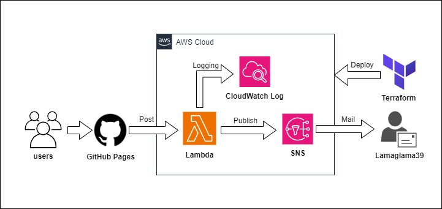

# About-Lamaglama39
無心でラマをくるくるしてください...。

## URL
[https://lamaglama39.github.io/About-Lamaglama39/](https://lamaglama39.github.io/About-Lamaglama39/)

## インフラ構成図

## 使用技術
| Category          | Technology Stack                             |
| ----------------- | ---------------------------------------------|
| Frontend          | React, vite, Three.js                        |
| Backend           | Node.js                                      |
| Infrastructure    | AWS(Lambda, SNS, CloudWatch Logs), Terraform |
| Design            | Figma                                        |
| etc               | Blender, GitHub Pages                        |

## 今後の展望
- ラマとのおしゃべり機能 (OpenAI)
- 技術投稿記事を取得する機能 (Qiita,Zenn etc...)

## 素材クレジット
- <a target="_blank" href="https://icons8.com/icon/WncR8Bcg5nE9/terraform">Terraform</a> icon by <a target="_blank" href="https://icons8.com">Icons8</a>